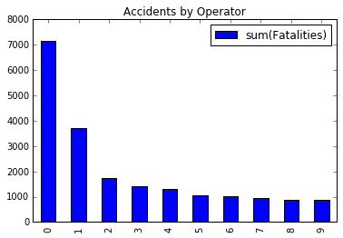
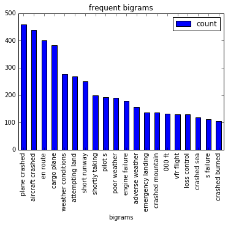

```python
import pandas as pd
from collections import Counter
from pyspark.sql.functions import desc,udf,col
from pyspark.ml.feature import Tokenizer, RegexTokenizer
from pyspark.ml.feature import Word2Vec,NGram,StopWordsRemover
from pyspark.sql.types import IntegerType
```

###  Loading the data from a CSV file and read as SQLContext 


```python
sql = SQLContext(sc)

accidents = (sql.read
         .format("com.databricks.spark.csv")
         .option("header", "true")
         .load("/resources/Airplane_Crashes.csv"))
```

Printing the schema of the RDD


```python
print(accidents.printSchema())
```

    root
     |-- Date: string (nullable = true)
     |-- Time: string (nullable = true)
     |-- Location: string (nullable = true)
     |-- Operator: string (nullable = true)
     |-- Flight #: string (nullable = true)
     |-- Route: string (nullable = true)
     |-- Type: string (nullable = true)
     |-- Registration: string (nullable = true)
     |-- cn/In: string (nullable = true)
     |-- Aboard: string (nullable = true)
     |-- Fatalities: string (nullable = true)
     |-- Ground: string (nullable = true)
     |-- Summary: string (nullable = true)
    
    None


### Converting string column to integer column


```python
accidents = accidents.withColumn("Fatalitiestmp", accidents.Fatalities.cast("Integer")).drop("Fatalities").withColumnRenamed("Fatalitiestmp", "Fatalities")
```


```python
print(accidents.printSchema())
```

    root
     |-- Date: string (nullable = true)
     |-- Time: string (nullable = true)
     |-- Location: string (nullable = true)
     |-- Operator: string (nullable = true)
     |-- Flight #: string (nullable = true)
     |-- Route: string (nullable = true)
     |-- Type: string (nullable = true)
     |-- Registration: string (nullable = true)
     |-- cn/In: string (nullable = true)
     |-- Aboard: string (nullable = true)
     |-- Ground: string (nullable = true)
     |-- Summary: string (nullable = true)
     |-- Fatalities: integer (nullable = true)
    
    None


## List of top 10 killer operators


```python
import matplotlib
%matplotlib inline  
```


```python

pd_data = accidents.select('Operator','Fatalities').groupby('Operator').sum('Fatalities').sort(desc("sum(Fatalities)")).toPandas().head(10)
print(pd_data)
pd_data.plot(kind='bar',title='Accidents by Operator')

```

                              Operator  sum(Fatalities)
    0                         Aeroflot           7156.0
    1        Military - U.S. Air Force           3717.0
    2                       Air France           1734.0
    3                American Airlines           1421.0
    4       Pan American World Airways           1302.0
    5  Military - U.S. Army Air Forces           1070.0
    6                 United Air Lines           1021.0
    7                          AVIANCA            941.0
    8           Turkish Airlines (THY)            891.0
    9                  Indian Airlines            863.0


    <matplotlib.axes._subplots.AxesSubplot at 0x7fc984130fd0>





### Top routes that caused most accidents


```python
accidents.groupby('Route').count().sort(desc("count")).dropna().toPandas().head(10)
```


<div>
<table border="1" class="dataframe">
  <thead>
    <tr style="text-align: right;">
      <th></th>
      <th>Route</th>
      <th>count</th>
    </tr>
  </thead>
  <tbody>
    <tr>
      <th>0</th>
      <td></td>
      <td>1706</td>
    </tr>
    <tr>
      <th>1</th>
      <td>Training</td>
      <td>81</td>
    </tr>
    <tr>
      <th>2</th>
      <td>Sightseeing</td>
      <td>29</td>
    </tr>
    <tr>
      <th>3</th>
      <td>Test flight</td>
      <td>17</td>
    </tr>
    <tr>
      <th>4</th>
      <td>Test</td>
      <td>6</td>
    </tr>
    <tr>
      <th>5</th>
      <td>Sao Paulo - Rio de Janeiro</td>
      <td>5</td>
    </tr>
    <tr>
      <th>6</th>
      <td>Saigon - Paris</td>
      <td>4</td>
    </tr>
    <tr>
      <th>7</th>
      <td>Sao Paulo - Porto Alegre</td>
      <td>4</td>
    </tr>
    <tr>
      <th>8</th>
      <td>Bogota - Barranquilla</td>
      <td>4</td>
    </tr>
    <tr>
      <th>9</th>
      <td>Villavicencio - Mitu</td>
      <td>4</td>
    </tr>
  </tbody>
</table>
</div>


### Aircraft type that caused most accidents

Douglas's involvement in the world wars could be the cause to this unfortunate stat


```python
accidents.groupby('Type').count().sort(desc("count")).toPandas().head(10)
```


<div>
<table border="1" class="dataframe">
  <thead>
    <tr style="text-align: right;">
      <th></th>
      <th>Type</th>
      <th>count</th>
    </tr>
  </thead>
  <tbody>
    <tr>
      <th>0</th>
      <td>Douglas DC-3</td>
      <td>334</td>
    </tr>
    <tr>
      <th>1</th>
      <td>de Havilland Canada DHC-6 Twin Otter 300</td>
      <td>81</td>
    </tr>
    <tr>
      <th>2</th>
      <td>Douglas C-47A</td>
      <td>74</td>
    </tr>
    <tr>
      <th>3</th>
      <td>Douglas C-47</td>
      <td>62</td>
    </tr>
    <tr>
      <th>4</th>
      <td>Douglas DC-4</td>
      <td>40</td>
    </tr>
    <tr>
      <th>5</th>
      <td>Yakovlev YAK-40</td>
      <td>37</td>
    </tr>
    <tr>
      <th>6</th>
      <td>Antonov AN-26</td>
      <td>36</td>
    </tr>
    <tr>
      <th>7</th>
      <td>Junkers JU-52/3m</td>
      <td>32</td>
    </tr>
    <tr>
      <th>8</th>
      <td>Douglas C-47B</td>
      <td>29</td>
    </tr>
    <tr>
      <th>9</th>
      <td>De Havilland DH-4</td>
      <td>28</td>
    </tr>
  </tbody>
</table>
</div>


```python
sentenceDataFrame  = accidents.select('Summary')
regexTokenizer = RegexTokenizer(inputCol="Summary", outputCol="words", pattern="\\W")
```


```python
countTokens = udf(lambda words: len(words), IntegerType())
```


```python
regexTokenized = regexTokenizer.transform(sentenceDataFrame)
regexTokenized.select("words") \
        .withColumn("tokens", countTokens(col("words"))).show()
words_df = regexTokenized.select("words")
```

    +--------------------+------+
    |               words|tokens|
    +--------------------+------+
    |[during, a, demon...|    86|
    |[first, u, s, dir...|    19|
    |[the, first, fata...|    18|
    |[the, airship, fl...|    35|
    |[hydrogen, gas, w...|    25|
    |[crashed, into, t...|    16|
    |[exploded, and, b...|    15|
    |[crashed, near, t...|     7|
    |[shot, down, by, ...|     8|
    |[shot, down, in, ...|    11|
    |[crashed, in, a, ...|     4|
    |[shot, down, by, ...|    15|
    |[caught, fire, an...|     4|
    |[struck, by, ligh...|     8|
    |[crashed, into, t...|    18|
    |[shot, down, by, ...|     5|
    |[shot, down, by, ...|     5|
    |[shot, down, by, ...|     7|
    |[exploded, and, c...|    12|
    |[shot, down, by, ...|    13|
    +--------------------+------+
    only showing top 20 rows
    


## Tokenize the words in summary column and plot the top bigram given as a resaon for the accidents


```python
word2Vec = Word2Vec(vectorSize=3, minCount=0, inputCol="words", outputCol="result")
model = word2Vec.fit(words_df.select("words"))
result = model.transform(words_df.select("words"))

```


```python
remover = StopWordsRemover(inputCol="words", outputCol="filtered_words")
data_df = remover.transform(words_df.select("words")).select('filtered_words')

```


```python
data_df.head()
```


    Row(filtered_words=['demonstration', 'flight', 'u', 's', 'army', 'flyer', 'flown', 'orville', 'wright', 'nose', 'dived', 'ground', 'height', 'approximately', '75', 'feet', 'killing', 'lt', 'thomas', 'e', 'selfridge', 'passenger', 'recorded', 'airplane', 'fatality', 'history', 'propellers', 'separated', 'flight', 'tearing', 'loose', 'wires', 'bracing', 'rudder', 'causing', 'loss', 'control', 'aircraft', 'orville', 'wright', 'suffered', 'broken', 'ribs', 'pelvis', 'leg', 'selfridge', 'suffered', 'crushed', 'skull', 'died', 'short', 'time', 'later'])


```python
ngram = NGram(inputCol="filtered_words", outputCol="ngrams")
ngramDataFrame = ngram.transform(data_df)
print(ngramDataFrame.printSchema())

```

    root
     |-- filtered_words: array (nullable = true)
     |    |-- element: string (containsNull = true)
     |-- ngrams: array (nullable = true)
     |    |-- element: string (containsNull = false)
    
    None


### Using MapReduce to find the top bigrams counter


```python
def line_to_ngrams(line):
    print("val" +str(line))
    return line[0]
    
```


```python
from operator import add
ng=ngramDataFrame.select("ngrams")
result = ng.flatMap(line_to_ngrams).map(lambda x: (x, 1)) \
                  .reduceByKey(add).sortBy(lambda x: x[1], ascending=False).collect()
    

```

### A plot of top bigrams in summary column


```python
result_df = pd.DataFrame.from_records(result[:20], columns=['bigrams','count'])
result_df.plot(kind='bar',title='frequent bigrams', x = result_df.bigrams )
```


    <matplotlib.axes._subplots.AxesSubplot at 0x7fc964d7ba58>





```python

```
